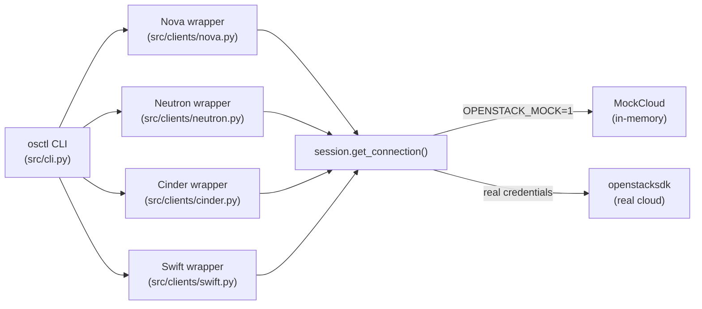

# openstack

A practical toolkit for automating OpenStack — Python SDK wrappers, a friendly CLI, Heat orchestration templates, and Terraform configuration, all in one place.

---

## Why I built this

Working with OpenStack across different projects, I kept rewriting the same boilerplate: connect to Keystone, list servers, attach a volume, wire up a router. I got tired of copy-pasting snippets from old scripts and decided to put everything into a single, well-organized repo that I could actually reuse and build on.

There's another thing that always slowed me down: you can't do much without a live cloud. So I built a mock layer that mirrors the real SDK in memory. The CLI, the tests, and all the examples run offline with `OPENSTACK_MOCK=1` — no credentials, no network, no waiting.

---

## What's inside

- **Python SDK wrappers** for Nova (compute), Neutron (networking), Cinder (block storage), and Swift (object storage) — clean, typed, documented
- **`osctl` CLI** — a Click-based command-line tool that ties the wrappers together with rich table output
- **Mock/dry-run mode** — an in-memory cloud simulation so everything works offline
- **Heat HOT templates** — a production-ready 3-tier web stack with autoscaling and Ceilometer alarms
- **Terraform configuration** — equivalent infrastructure declared with the OpenStack provider

---

## Tech stack

| Layer | Library / tool |
|---|---|
| Python | 3.11 |
| OpenStack SDK | openstacksdk >= 2.0 |
| CLI | click >= 8.1 |
| Output | rich >= 13 |
| Config | pyyaml >= 6 |
| Tests | pytest >= 7 |
| IaC | Terraform >= 1.5 + terraform-provider-openstack |
| Orchestration | Heat HOT (2018-08-31) |

---

## Quick start

You don't need a real OpenStack cloud to try this. Set `OPENSTACK_MOCK=1` and everything runs in memory.

```bash
git clone https://github.com/omprxkash/openstack.git
cd openstack
pip install -r requirements.txt

# Run the CLI in mock mode
export OPENSTACK_MOCK=1
python -m src.cli server list
```

---

## CLI usage

All commands accept `--mock` (or the `OPENSTACK_MOCK=1` env var) for offline use.

```bash
# Servers
python -m src.cli --mock server list
python -m src.cli --mock server create --name web1 --image ubuntu-22.04 --flavor m1.small --network private
python -m src.cli --mock server console <server-id>
python -m src.cli --mock server delete <server-id>

# Networks
python -m src.cli --mock network list
python -m src.cli --mock network create --name private --cidr 10.0.0.0/24

# Volumes
python -m src.cli --mock volume list
python -m src.cli --mock volume create --name data --size 10
python -m src.cli --mock volume attach --volume <vol-id> --server <server-id>
python -m src.cli --mock volume snapshot --volume <vol-id> --name snap-01

# Object storage
python -m src.cli --mock object list backups
python -m src.cli --mock object upload --container backups --file ./dump.sql
python -m src.cli --mock object download --container backups --name dump.sql
```

---

## How it works



The session factory (`src/clients/session.py`) is the only place that decides whether to talk to a real cloud or the mock. Everything above it is identical either way.

---

## Project structure

```
openstack/
├── src/
│   ├── clients/
│   │   ├── session.py       # connection factory
│   │   ├── nova.py          # compute operations
│   │   ├── neutron.py       # networking operations
│   │   ├── cinder.py        # block storage operations
│   │   └── swift.py         # object storage operations
│   ├── mock/
│   │   └── mock_cloud.py    # in-memory cloud simulation
│   ├── cli.py               # Click CLI entrypoint
│   └── config.py            # env/yaml config loader
├── heat/
│   ├── web_stack.yaml       # 3-tier web stack HOT template
│   ├── autoscaling.yaml     # Ceilometer alarm definitions
│   └── README.md
├── terraform/
│   ├── main.tf
│   ├── variables.tf
│   ├── outputs.tf
│   └── README.md
├── examples/
│   ├── launch_vm.py
│   ├── create_network.py
│   ├── attach_volume.py
│   └── upload_object.py
├── tests/
│   ├── test_nova.py
│   ├── test_neutron.py
│   ├── test_cinder.py
│   └── test_cli.py
├── requirements.txt
├── .env.example
└── LICENSE
```

---

## Pointing at a real cloud

**Option 1 — Environment variables**

```bash
cp .env.example .env
# Edit .env with your real OS_* values and remove OPENSTACK_MOCK=1
source .env
python -m src.cli server list
```

**Option 2 — clouds.yaml**

```yaml
# clouds.yaml (keep this out of version control)
clouds:
  mycloud:
    auth:
      auth_url: https://keystone.example.com:5000/v3
      project_name: myproject
      username: myuser
      password: mypassword
    region_name: RegionOne
```

```bash
export OS_CLOUD=mycloud
python -m src.cli server list
```

---

## Running the examples

```bash
OPENSTACK_MOCK=1 python examples/launch_vm.py
OPENSTACK_MOCK=1 python examples/create_network.py
OPENSTACK_MOCK=1 python examples/attach_volume.py
OPENSTACK_MOCK=1 python examples/upload_object.py
```

---

## Testing

All tests run against the mock layer — no real cloud needed.

```bash
pytest
```

To run a specific suite:

```bash
pytest tests/test_nova.py -v
pytest tests/test_cli.py -v
```

---

## Heat & Terraform

- **Heat** — see [heat/README.md](heat/README.md) for deployment steps
- **Terraform** — see [terraform/README.md](terraform/README.md) for init/plan/apply

---

## Known limitations

- The mock layer doesn't simulate timing (e.g. volume state transitions), so tests that depend on real async state changes won't work without a live cloud.
- The Heat templates target the Octavia LB and Aodh/Ceilometer alarm APIs — make sure your cloud has these services enabled before deploying.
- Terraform's OpenStack provider requires the cloud to expose Keystone v3. v2 endpoints are not supported.
- Swift in the mock doesn't persist across process restarts — it's purely in-memory and resets each run.

---

## Contributing

Found a bug or want to add support for another OpenStack service? Pull requests are welcome.

**Author:** [omprxkash](https://github.com/omprxkash)
